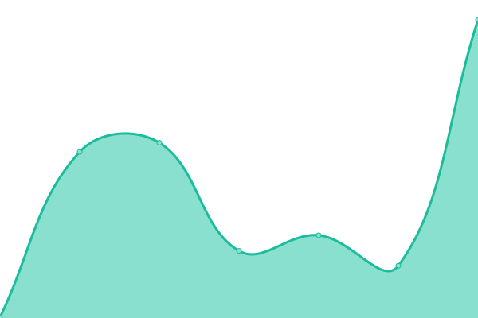
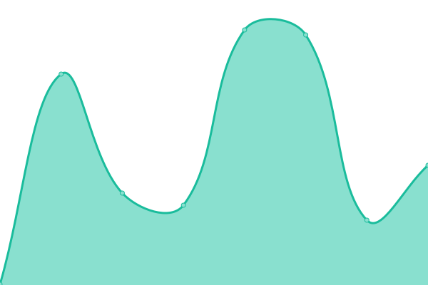
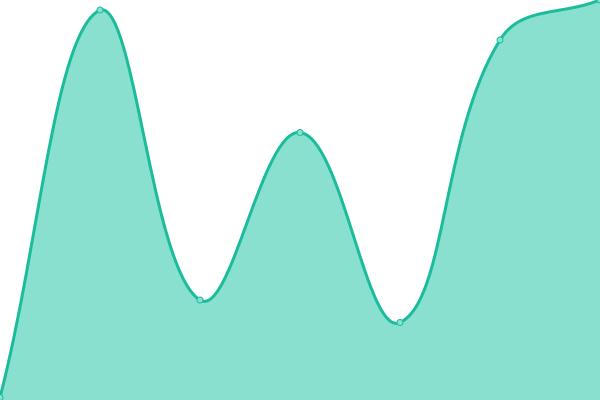

# [📈 Live Status](https://status.gpg.ink): <!--live status--> **🟧 Partial outage**

This repository contains the open-source uptime monitor and status page for [IMGUGU.INK](https://blog.imgugu.ink), powered by [Upptime](https://github.com/upptime/upptime).

With [Upptime](https://upptime.js.org), you can get your own unlimited and free uptime monitor and status page, powered entirely by a GitHub repository. We use [Issues](https://github.com/sider2vf/upptime/issues) as incident reports, [Actions](https://github.com/sider2vf/upptime/actions) as uptime monitors, and [Pages](https://status.gpg.ink) for the status page.

<!--start: status pages-->
<!-- This summary is generated by Upptime (https://github.com/upptime/upptime) -->
<!-- Do not edit this manually, your changes will be overwritten -->
<!-- prettier-ignore -->
| URL | Status | History | Response Time | Uptime |
| --- | ------ | ------- | ------------- | ------ |
|  [IMGUGU Home](https://www.imgugu.ink/) | 🟥 Down | [imgugu-home.yml](https://github.com/sider2vf/upptime/commits/HEAD/history/imgugu-home.yml) | 

 212ms
     
 | 

<a href="https://service.gpg.ink/history/imgugu-home">0.00%</a>
    

|  [Gugu's Blog](https://blog.imgugu.ink/) | 🟥 Down | [gugu-s-blog.yml](https://github.com/sider2vf/upptime/commits/HEAD/history/gugu-s-blog.yml) | 

 204ms
     
 | 

<a href="https://service.gpg.ink/history/gugu-s-blog">0.00%</a>
    

|  [Pigeon IT Access (SSO)](https://sso.imgugu.ink/) | 🟥 Down | [pigeon-it-access-sso.yml](https://github.com/sider2vf/upptime/commits/HEAD/history/pigeon-it-access-sso.yml) | 

 215ms
     
 | 

<a href="https://service.gpg.ink/history/pigeon-it-access-sso">0.00%</a>
    

|  [Anime Pic](https://moe.imgugu.ink/) | 🟥 Down | [anime-pic.yml](https://github.com/sider2vf/upptime/commits/HEAD/history/anime-pic.yml) | 

 154ms
     
 | 

<a href="https://service.gpg.ink/history/anime-pic">0.00%</a>
    

|  [IMGUGU Music](https://music.imgugu.ink/) | 🟩 Up | [imgugu-music.yml](https://github.com/sider2vf/upptime/commits/HEAD/history/imgugu-music.yml) | 

 164ms
     
 | 

<a href="https://service.gpg.ink/history/imgugu-music">100.00%</a>
    

|  [Pigeon SNS Web](https://gpg.ink/) | 🟩 Up | [pigeon-sns-web.yml](https://github.com/sider2vf/upptime/commits/HEAD/history/pigeon-sns-web.yml) | 

 350ms
     
 | 

<a href="https://service.gpg.ink/history/pigeon-sns-web">100.00%</a>
    

|  [Pigeon SNS API Endpoint](https://gpg.ink/api/v1/instance/) | 🟩 Up | [pigeon-sns-api-endpoint.yml](https://github.com/sider2vf/upptime/commits/HEAD/history/pigeon-sns-api-endpoint.yml) | 

 100ms
     
 | 

<a href="https://service.gpg.ink/history/pigeon-sns-api-endpoint">100.00%</a>
    

|  [Pigeon SNS Object Storage](https://mcdn.gpg.ink/) | 🟩 Up | [pigeon-sns-object-storage.yml](https://github.com/sider2vf/upptime/commits/HEAD/history/pigeon-sns-object-storage.yml) | 

 228ms
     
 | 

<a href="https://service.gpg.ink/history/pigeon-sns-object-storage">100.00%</a>
    

<!--end: status pages-->

[**Visit our status website →**](https://status.gpg.ink)

## 📄 License

- Powered by: [Upptime](https://github.com/upptime/upptime)
- Code: [MIT](./LICENSE) © [IMGUGU.INK](https://blog.imgugu.ink)
- Data in the `./history` directory: [Open Database License](https://opendatacommons.org/licenses/odbl/1-0/)
